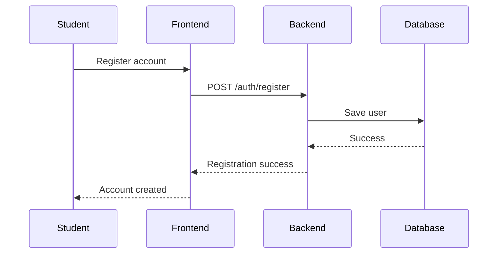
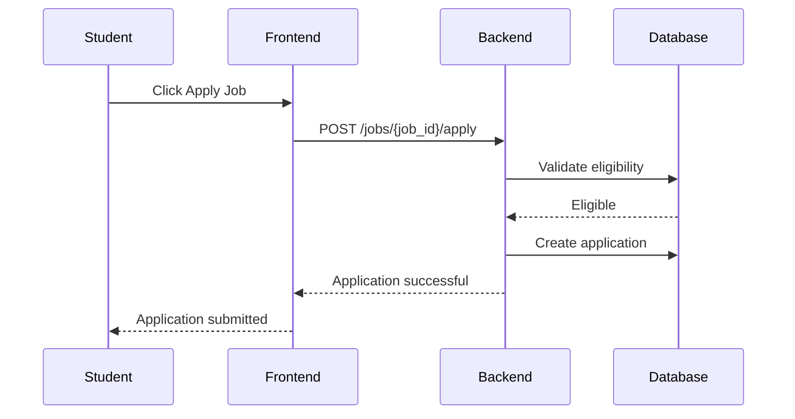
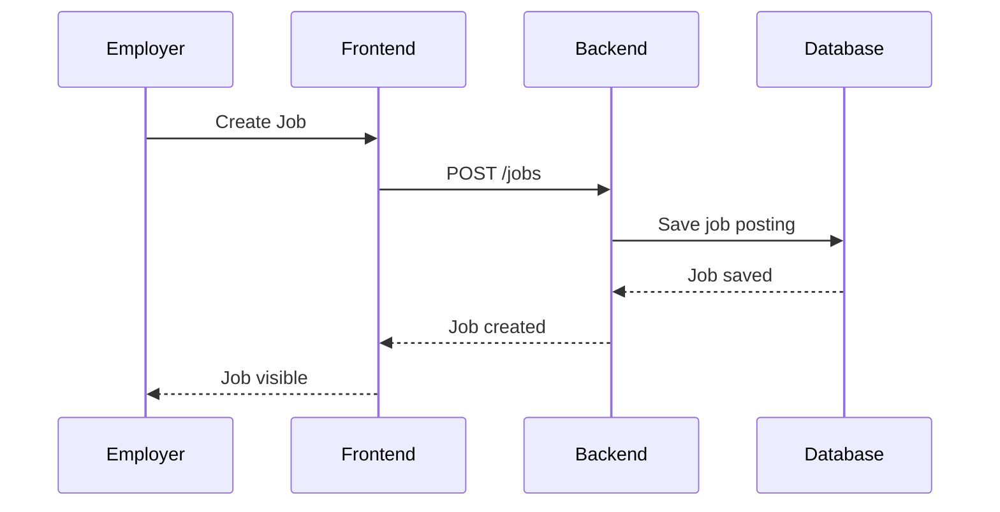
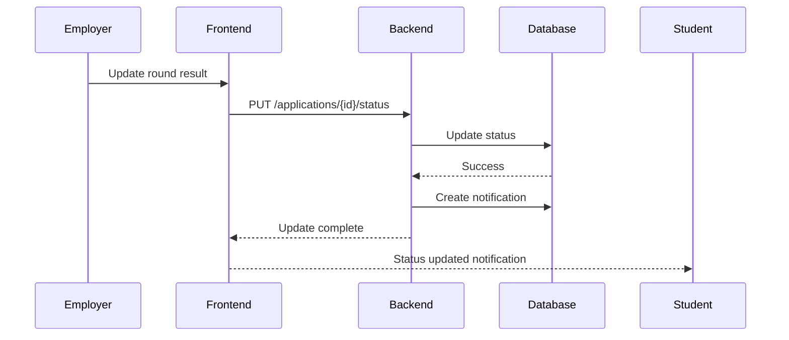

# Placement Automation Tool (PAT)
## Sequence Diagrams

This document illustrates key workflows in the Placement Automation Tool.

---

# 1. Student Registration Flow

---

# 2. Job Application Flow

---

# 3. Employer Job Posting Flow

---

# 4. Recruitment Round Update Flow

---

# Key System Workflows Covered

The diagrams represent the main system operations:

1. Student registration
2. Job application
3. Employer job posting
4. Recruitment round updates

These workflows define the primary interactions between users and the PAT system.
