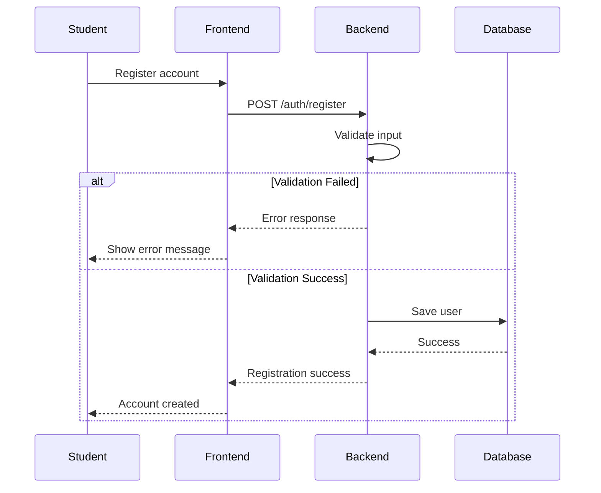
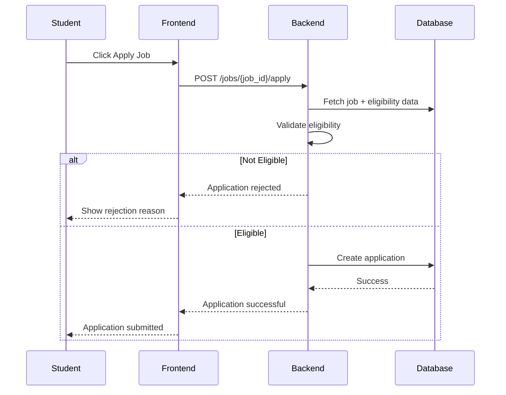
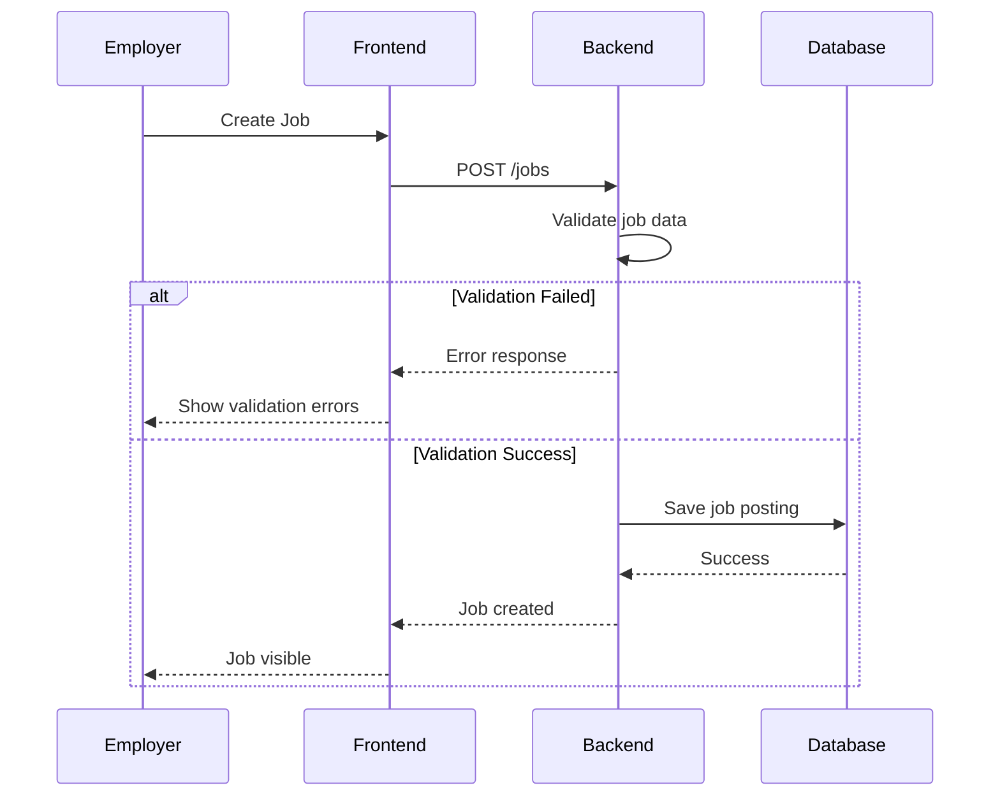
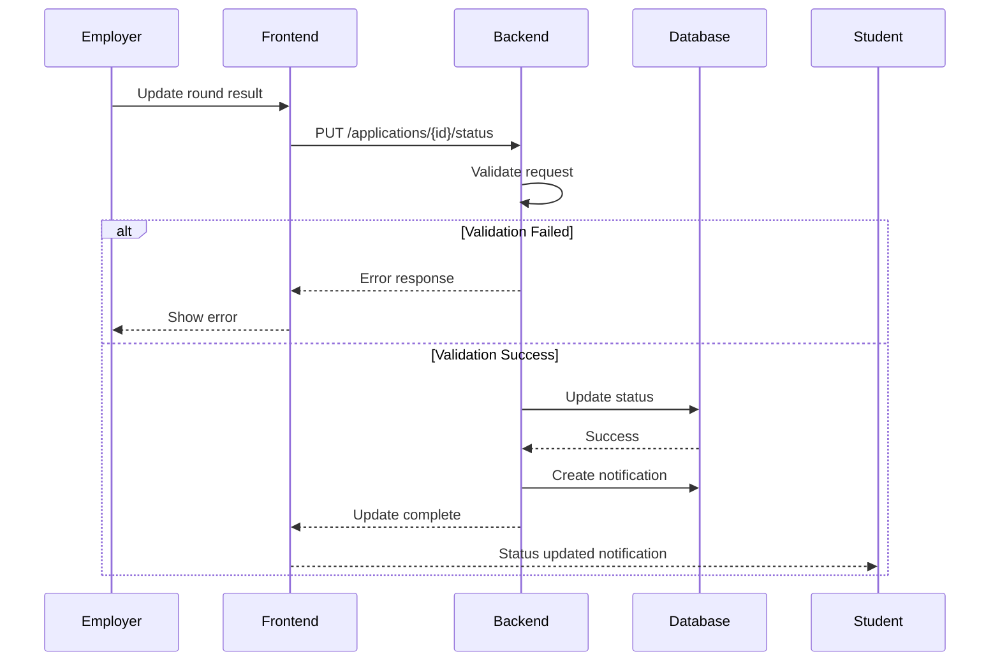

# Placement Automation Tool (PAT)

## Sequence Diagrams

This document illustrates key workflows in the Placement Automation Tool.

---

# 1. Student Registration Flow

---

# 2. Job Application Flow

---

# 3. Employer Job Posting Flow

---

# 4. Recruitment Round Update Flow

---

# Key System Workflows Covered

The diagrams represent the main system operations:

1. Student registration with validation
2. Job application with eligibility checks
3. Employer job posting with strict validation
4. Recruitment round updates with validation and notification

These workflows define both **successful and failure paths** in the system.
