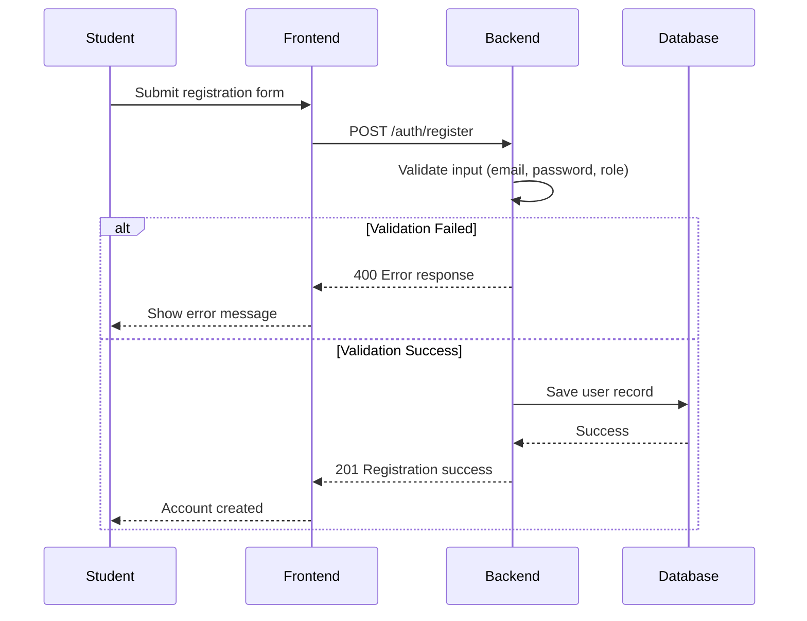
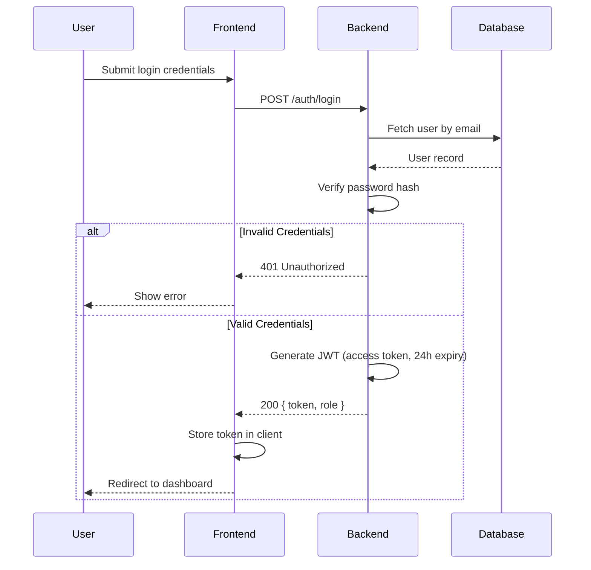
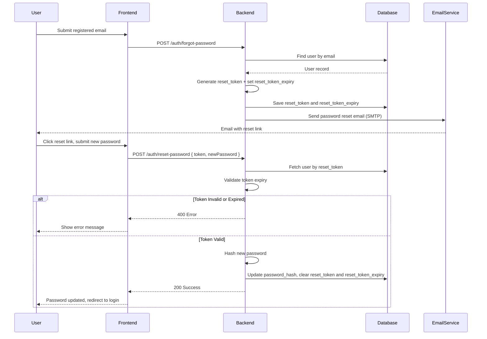
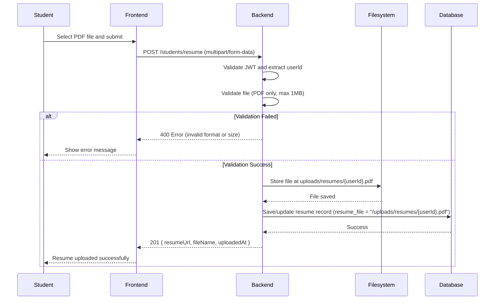
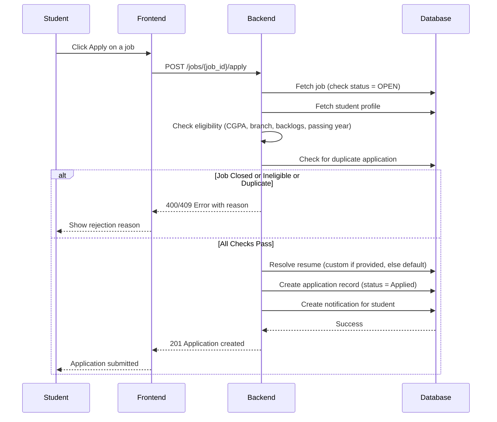
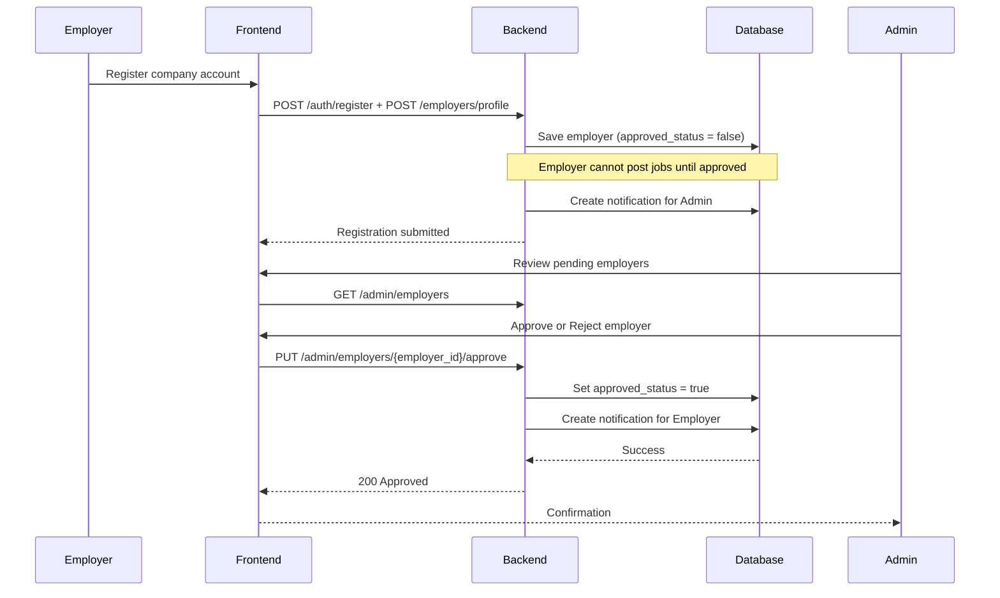
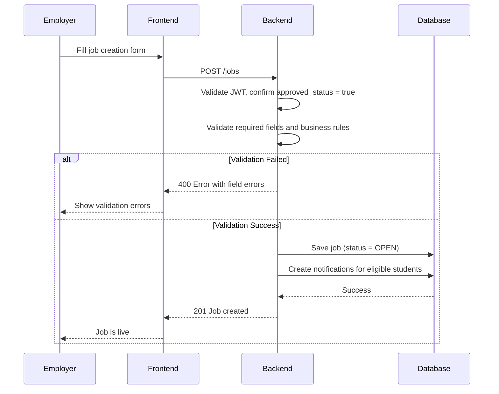
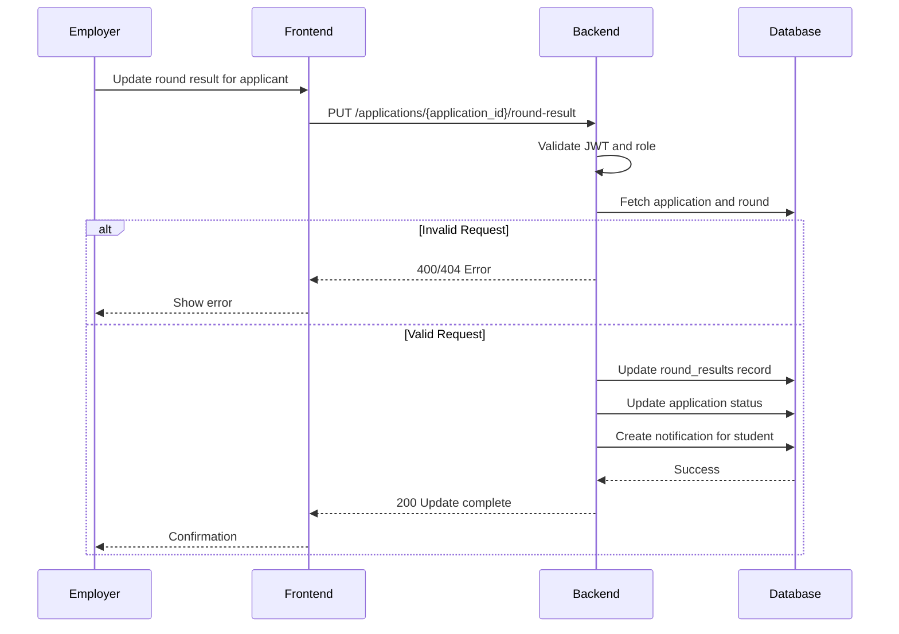
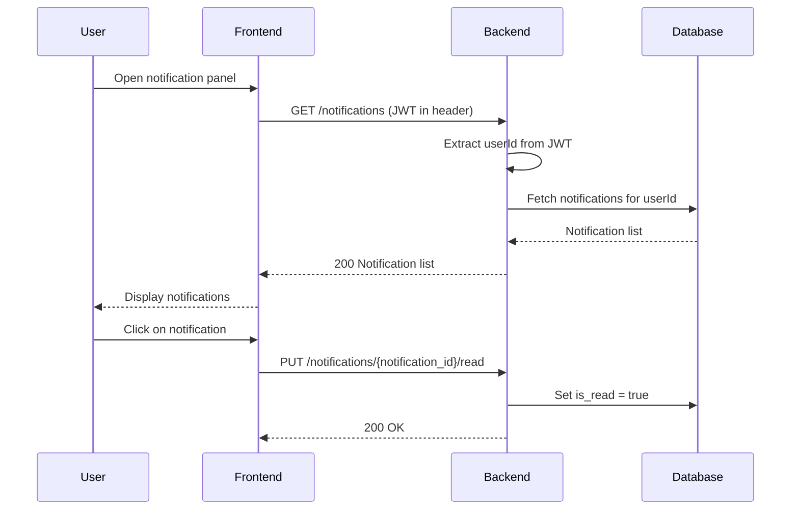

# Placement Automation Tool (PAT)

## Sequence Diagrams

This document illustrates the key workflows in the Placement Automation Tool.

---

# 1. Student Registration Flow

---

# 2. Login and JWT Flow

**Notes:**
- Only access tokens are used. There is no refresh token mechanism.
- Token expiry is 24 hours. After expiry the user must log in again.
- All subsequent requests include the JWT in the Authorization header.

---

# 3. Forgot Password Flow

---

# 4. Resume Upload Flow

**Notes:**
- Uploading a new resume overwrites the existing file for the same user.
- `resume_file` in the database stores the server path, not the binary file.
- Employers access resumes by navigating to `http://localhost:8080/uploads/resumes/{userId}.pdf`.

---

# 5. Job Application Flow

---

# 6. Employer Approval Flow

---

# 7. Employer Job Posting Flow

---

# 8. Recruitment Round Update Flow

---

# 9. Notification Fetch Flow

**Notes:**
- Notifications are fetched on-demand (REST polling). There is no WebSocket or Server-Sent Events implementation.
- Notifications are created server-side on relevant events (job creation, status updates, round results).
