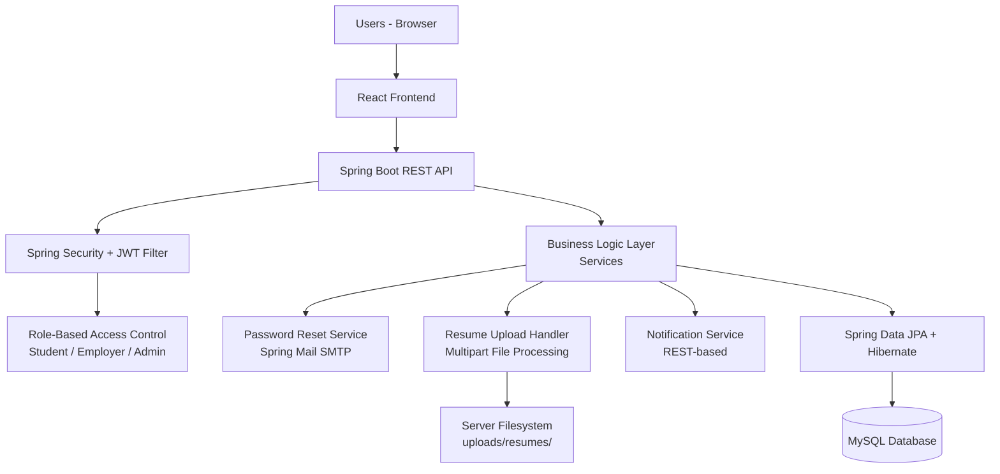

# Placement Automation Tool (PAT)

## System Architecture

This document describes the architecture of the Placement Automation Tool (PAT).

---

## Overview

PAT is a 3-tier web application:

1. Presentation Layer — React frontend
2. Application Layer — Spring Boot backend
3. Data Layer — MySQL database

In addition to the three core tiers, the system includes:

- JWT Security Layer
- Multipart File Upload System
- Filesystem-based Resume Storage
- SMTP-based Password Reset Email Service

---

## Architecture Diagram

---

## Layer Descriptions

### 1. Presentation Layer

Technology: **React.js + Vite + TailwindCSS + Axios**

Responsibilities:

- Authentication interface (login, register, forgot/reset password)
- Student dashboard (eligible jobs, applications, analytics)
- Employer dashboard (job management, applicant tracking, round results)
- Admin dashboard (employer approvals, system monitoring)
- Resume upload interface
- Notification display panel

Communication with backend: 
REST API calls over HTTP using Axios
JWT token attached to Authorization header on every request

---

### 2. Application Layer

Technology: **Java + Spring Boot + Spring Web**

Components:

- REST Controllers — handle incoming HTTP requests
- Services — contain all business logic
- Security Filter — intercepts and validates JWT on every request
- DTO Layer — request/response data transfer objects

Responsibilities:

- User authentication and JWT issuance
- Role-based access enforcement
- Input validation (API-level, before DB operations)
- Student profile and academic data management
- Employer registration and approval workflow
- Job posting lifecycle management
- Job application processing with eligibility checks
- Recruitment round and round result management
- Notification creation and retrieval
- Resume file handling

---

### 3. Security Layer

Technology: **Spring Security + JWT (HS256)**

Implementation:

- On login, the backend generates a signed JWT containing the user's email and role
- Token expiry: **24 hours**
- No refresh tokens. After expiry, the user must log in again
- Every API request passes through `JwtAuthenticationFilter`, which validates the token and loads the security context
- Role-based authorization is enforced at the controller level

Roles:

| Role     | Access Scope                                      |
|----------|---------------------------------------------------|
| Student  | Profile, resume, jobs, applications, notifications |
| Employer | Job management, applicants, recruitment rounds     |
| Admin    | Employer approval, system monitoring, statistics   |

---

### 4. File Storage Layer

Technology: **Spring Multipart + Java NIO (Files.copy)**

Resume upload flow:

1. Frontend sends PDF as `multipart/form-data`
2. Backend validates: PDF only, max 1MB, sanitized filename
3. File is written to server filesystem at `uploads/resumes/{userId}.pdf`
4. Uploading again overwrites the previous file
5. Database stores the path (`/uploads/resumes/{userId}.pdf`), not the binary

Employer access:
http://localhost:8080/uploads/resumes/{userId}.pdf

Browser renders the PDF directly.

---

### 5. Password Reset Email Service

Technology: **Spring Mail + Java MailSender + SMTP**

Flow:

1. User submits registered email
2. Backend generates a `reset_token` with `reset_token_expiry`
3. Token is persisted in the `users` table
4. Reset email is sent via SMTP
5. User clicks the link, submits a new password
6. Backend validates the token and expiry, updates the password, clears the token fields

**Scope:** Email is used **only** for password reset. General notification emails are not implemented. Application and status notifications are stored in the database and fetched on-demand via REST API.

---

### 6. Notification Service

Technology: **Spring Boot REST (on-demand fetch)**

Implementation:

- Notifications are created server-side on events: job creation, application status updates, round result updates
- Frontend fetches notifications by calling `GET /notifications` when the user opens the notification panel
- No WebSocket, no SSE, no real-time push

---

### 7. Data Access Layer

Technology: **Spring Data JPA + Hibernate ORM**

Responsibilities:

- Maps Java entity classes to MySQL tables
- Handles all CRUD operations via JPA repositories
- Enforces relational constraints

---

### 8. Database Layer

Technology: **MySQL**

Stores:

- Users (with password reset token fields)
- Student profiles and academic records
- Employer profiles
- Job postings (with status lifecycle)
- Resumes (metadata and file path)
- Applications (with status progression)
- Recruitment rounds and round results
- Notifications
- Student analytics

---

## Data Flow Summary
Request:  User → React Frontend → REST API → JWT Filter → Service → JPA → MySQL
Response: MySQL → JPA → Service → REST Controller → Frontend → User

Resume upload:
Frontend → Multipart POST → Backend Validation → Filesystem (uploads/resumes/) → DB metadata save

Password reset:
Email request → Token generation → DB save → SMTP email → User clicks link → Token validation → Password update
