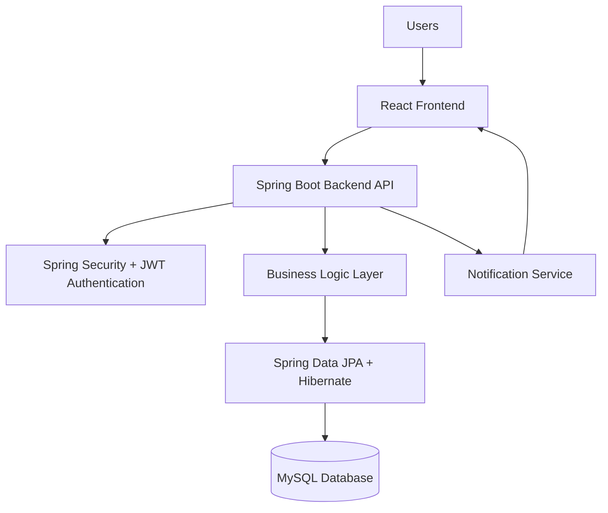

# Placement Automation Tool (PAT)
## System Architecture Diagram

This document describes the high‑level architecture of the Placement Automation Tool (PAT).

The system follows a **3‑tier architecture**:

1. Presentation Layer (Frontend)
2. Application Layer (Backend)
3. Data Layer (Database)

---

## Architecture Diagram



---

## Architecture Layers

### 1. Presentation Layer

Technology: **React.js**

Responsibilities:

- Login and authentication interface
- Student dashboard
- Employer dashboard
- Admin dashboard
- Job browsing and application UI
- Notification display
- Analytics dashboard

The frontend communicates with the backend using:

```
REST APIs over HTTP
```

---

### 2. Application Layer

Technology: **Spring Boot**

Components:

- REST Controllers
- Services
- Security layer
- Business logic

Responsibilities:

- Handle API requests
- Manage authentication
- Process job applications
- Manage recruitment rounds
- Generate analytics

---

### 3. Security Layer

Technology:

```
Spring Security
JWT Authentication
```

Responsibilities:

- User authentication
- Token generation
- Role‑based authorization
- Secure API access

Roles supported:

- Student
- Employer
- Admin

---

### 4. Data Access Layer

Technology:

```
Spring Data JPA
Hibernate ORM
```

Responsibilities:

- Map Java entities to database tables
- Handle database queries
- Maintain data consistency

---

### 5. Database Layer

Technology:

```
MySQL
```

Stores:

- Users
- Students
- Employers
- Jobs
- Applications
- Recruitment rounds
- Resume files
- Notifications
- Analytics data

---

## Data Flow Summary

Typical request flow:

```
User → React Frontend → REST API → Spring Boot Backend → MySQL Database
```

Response flow:

```
Database → Backend → Frontend → User
```

---

## Future Architecture Improvements

Possible future enhancements:

- Cloud deployment (AWS / Azure)
- Docker containerization
- Resume storage using cloud storage
- Email notification services
- Multi‑college system architecture
