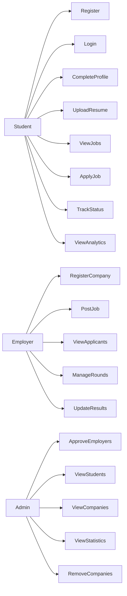

# Placement Automation Tool (PAT)
## Use Case Diagram

This document describes the interactions between system actors and the Placement Automation Tool.

Actors in the system:

- Student
- Employer
- Admin

---

## Use Case Diagram

---

## Actor Descriptions

### Student

Students interact with the system to participate in placement drives.

Main actions:

- Register and log in
- Complete profile
- Upload resumes
- View job opportunities
- Apply for jobs
- Track application status
- View placement analytics

---

### Employer

Employers represent company recruiters.

Main actions:

- Register company account
- Post job opportunities
- View applicants
- Manage recruitment rounds
- Update candidate results

Employers must be **approved by the Admin before posting jobs**.

---

### Admin

Admin represents the college placement cell.

Main actions:

- Approve employer registrations
- Monitor students and companies
- View placement statistics
- Remove suspicious or fake companies
