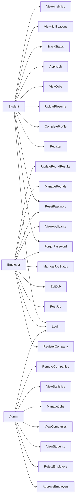

# Placement Automation Tool (PAT)

## Use Case Diagram

This document describes the interactions between system actors and the Placement Automation Tool.

Actors in the system:

- Student
- Employer
- Admin

All endpoints are protected by JWT authentication. Role-based access control is enforced at the backend.

---

## Use Case Diagram

---

## Actor Descriptions

### Student

Students interact with the system to participate in placement drives.

Main actions:

- Register and log in
- Reset password via email link
- Complete profile (including academic details)
- Upload resume (PDF, max 1MB)
- Browse eligible job listings
- Apply for jobs
- Track application and round status
- View notifications
- View placement analytics

---

### Employer

Employers represent company recruiters.

Main actions:

- Register company account
- Reset password via email link
- Post job opportunities with required and optional fields
- Edit existing job postings
- Manage job status (OPEN / CLOSED / DELETED)
- View and filter applicants
- Create recruitment rounds
- Update round results per applicant

Employers must be **approved by the Admin before posting jobs**.

---

### Admin

Admin represents the college placement cell.

Main actions:

- Approve or reject employer registrations
- Manage job postings
- Monitor student and company data
- View placement statistics
- Remove invalid or suspicious companies

---

## Use Case: Post Job

### Preconditions

- Employer is registered and logged in
- Employer has been approved by Admin

### Main Flow

1. Employer opens job creation form
2. Employer enters job details
3. System validates input
4. Validation passes → job is saved with status `OPEN`
5. Job becomes visible to eligible students

### Required Inputs

- job_title
- salary_package
- application_deadline
- placement_drive_date

### Optional Inputs

- job_description
- job_location
- min_cgpa
- eligible_branches
- max_backlogs
- passing_year

### Validation Rules

- Required fields must not be empty
- `application_deadline` must be a valid future date
- `placement_drive_date` must be ≥ `application_deadline`
- `min_cgpa` (if provided) must be between 0–10
- `max_backlogs` (if provided) must be ≥ 0

### Failure Scenarios

- Missing required fields → request rejected
- Invalid dates → request rejected
- Invalid numeric values → request rejected

---

## Use Case: Forgot Password / Reset Password

### Flow

1. User submits their registered email
2. System generates a `reset_token` and sets `reset_token_expiry`
3. System sends a password reset email via SMTP (Spring Mail)
4. User clicks the link in the email
5. User submits a new password
6. System validates the token and expiry, updates the password, clears the token

### Notes

- Email service is used **only** for password reset. General notification emails are not implemented.
- Notifications (job updates, status changes) are stored in the database and fetched via REST API.

---

## Use Case: Apply for Job

### Preconditions

- Student is registered and logged in
- Student has an uploaded resume
- Job status is `OPEN`
- Student meets eligibility criteria

### Main Flow

1. Student clicks Apply on a job
2. System checks eligibility (CGPA, branch, backlogs, passing year)
3. System checks for duplicate application
4. Student may optionally upload a custom resume; otherwise the default resume is used
5. Application is created with status `Applied`
6. Student receives a notification

### Failure Scenarios

- Student does not meet eligibility criteria → rejected
- Student has already applied → rejected
- No resume exists → rejected

---

## Use Case: Manage Job Status

### Flow

1. Employer selects a posted job
2. Employer updates status to `CLOSED` or `DELETED`
3. System persists the new status

### Effects

- `CLOSED` jobs no longer accept new applications
- `DELETED` jobs are removed from student-facing listings
- Only `OPEN` jobs appear in student dashboards and job lists
