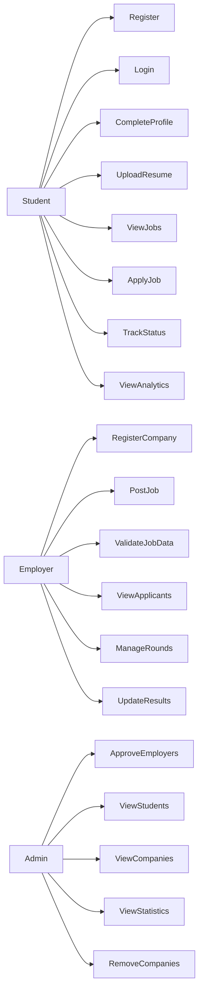

# Placement Automation Tool (PAT)

## Use Case Diagram

This document describes the interactions between system actors and the Placement Automation Tool.

Actors in the system:

* Student
* Employer
* Admin

---

## Use Case Diagram

---

## Actor Descriptions

### Student

Students interact with the system to participate in placement drives.

Main actions:

* Register and log in
* Complete profile
* Upload resumes
* View job opportunities
* Apply for jobs
* Track application status
* View placement analytics

---

### Employer

Employers represent company recruiters.

Main actions:

* Register company account
* Post job opportunities
* Provide required job details
* View applicants
* Manage recruitment rounds
* Update candidate results

Employers must be **approved by the Admin before posting jobs**.

---

## Updated Use Case: Post Job

### Description

Employer creates a job posting with required and optional fields.

---

### Preconditions

* Employer must be registered
* Employer must be approved by admin

---

### Main Flow

1. Employer opens job creation form
2. Employer enters job details
3. System validates input
4. If validation passes → job is created
5. Job becomes visible to students

---

### Required Inputs

* job_title
* salary_package
* application_deadline
* placement_drive_date

---

### Optional Inputs

* job_description
* job_location
* min_cgpa
* eligible_branches
* max_backlogs
* passing_year

---

### Validation Rules

* Required fields must not be empty
* application_deadline must be a valid future date
* placement_drive_date must be ≥ application_deadline
* min_cgpa (if provided) must be within valid range
* max_backlogs (if provided) must be ≥ 0

---

### Failure Scenarios

* Missing required fields → request rejected
* Invalid dates → request rejected
* Invalid numeric values → request rejected

---

### System Response

* Success → Job created
* Failure → Error message returned

---

### Admin

Admin represents the college placement cell.

Main actions:

* Approve employer registrations
* Monitor students and companies
* View placement statistics
* Remove suspicious or fake companies
